# Microservices E-Commerce & Dispatcher Platform (Yazlab-II Proje-1)

**Ekip Üyeleri:**  
Erkan HAZIR - 221307003  
Ferhat SEZGİN - 231307112  
**Tarih:** Nisan 2026

---

## Problemin Tanımı ve Amaç

### Problemin Tanımı

Günümüz yazılım ekosisteminde ölçeklenebilirlik ve bakım kolaylığı ihtiyacı, monolitik yapıların yerini mikroservis mimarilerine bırakmasına neden olmuştur. Ancak mikroservislerin sayısının artması; servisler arası trafik yönetimi, merkezi güvenlik protokollerinin (authentication/authorization) uygulanması ve servislerin dış dünyadan izole edilmesi gibi yeni problemleri beraberinde getirmiştir. Her bir servisin dış ağa doğrudan açık olması, güvenlik zafiyetlerine ve yönetimsel karmaşıklığa yol açmaktadır.

### Projenin Amacı

Bu proje, modern yazılım süreçlerinin temel taşlarından olan **Mikroservis Mimarisi** ve servis trafiğini merkezi bir noktadan yöneten bir **Dispatcher (API Gateway)** yazılımının uçtan uca geliştirilmesini amaçlamaktadır. Projenin temel hedefleri şunlardır:

- **Merkezi Trafik Yönetimi:** Tüm dış isteklerin tek bir Dispatcher üzerinden mikroservislere yönlendirilmesi.
- **Ağ İzolasyonu (Network Isolation):** Mikroservislerin dış ağa kapatılarak yalnızca Dispatcher üzerinden erişilebilir hale getirilmesi ve güvenliğin artırılması.
- **Test-Driven Development (TDD):** Dispatcher biriminin, hata payını minimize eden Red-Green-Refactor disipliniyle geliştirilmesi.
- **Rol Tabanlı Yetkilendirme:** Sistemdeki tüm işlemlerin; Misafir, Kullanıcı, Moderatör ve Yönetici (Admin) rollerine göre merkezi olarak denetlenmesi.

### Sistem Senaryosu: E-Ticaret Altyapısı

Proje kapsamında, yoğun trafik altında test edilmeye uygun bir e-ticaret senaryosu kurgulanmıştır. Sistemdeki yetki hiyerarşisi ve işlevler şu şekildedir:

- **Ziyaretçi (Rol Gerektirmeyen):** Ürün listeleme ve ürün detaylarını görüntüleme.
- **Kullanıcı:** Hesap oluşturma, profil yönetimi, sipariş oluşturma, sipariş takibi ve iptal işlemleri.
- **Moderatör:** Stok yönetimi (ürün ekleme/görüntüleme) ve genel sipariş yönetimi/güncelleme işlemleri.
- **Yönetici (Admin):** Kullanıcı ve rol yönetimi (CRUD işlemleri).
    - Tam yetkili ürün ve sipariş yönetimi.
    - **Sistem Gözlemleme:** Mikroservis ve Gateway loglarının takibi, son 5 dakikalık trafik analizi ve her bir endpoint trafik istatistiklerinin incelenmesi.

---

## Mimari ve Mikroservis İzolasyonu

Uygulamanın tamamı Dockerize edilmiş olup tam ağ ve veri izolasyonuna sahiptir. Dış dünya (Client) sadece Gateway ve Frontend uygulamasına erişebilir. Auth, Product ve Order servisleri yalnızca Docker'ın dahili ağı olan `backend-network` üzerinde iletişim kurarlar ve dışarıya port açmazlar. Mikroservis mimarisinin getirdiği diğer bir özellik ise Gateway, Auth, Product ve Order servislerinin ayrı kendilerine ait veri tabanlarına sahiptir.

### Sistemin Genel Mimarisi

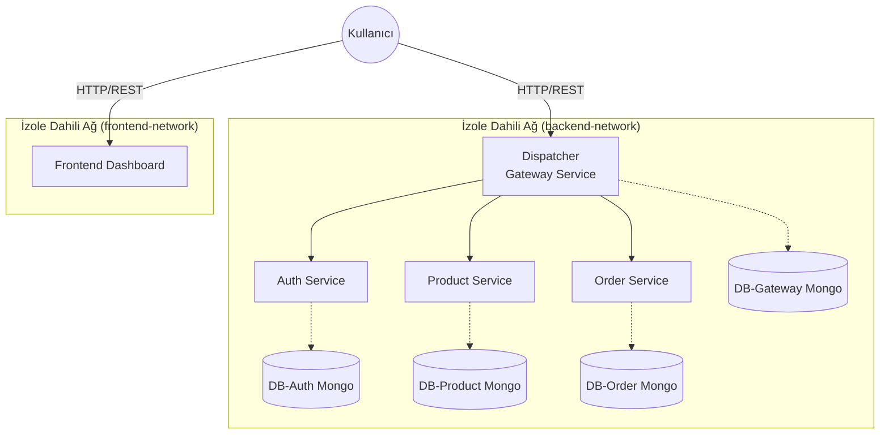

---

## Richardson Olgunluk Modeli (RMM) ve REST Disiplini

Projedeki endpoint yönetimi Seviye 3 olacak şekilde tasarlanmıştır. Oluşturulan senaryoda product ve order endpointlerinde kullanıcıyı detaylarına yönlendirmek üzere kullanılmıştır.

<details>
<summary> Örnek RMM 3 Seviyesi </summary>

`GET /api/products`

```json
[
    {
        "_id": "69d14a922d2f32e960072b6c",
        "name": "Test Product 1775323790941",
        "description": "Test product for API testing",
        "price": 9999,
        "stock": 10,
        "category": "Test Category",
        "createdAt": "2026-04-04T17:29:54.757Z",
        "updatedAt": "2026-04-04T17:29:54.757Z",
        "__v": 0,
        "_links": {
            "self": {
                "href": "/api/products/69d14a922d2f32e960072b6c"
            },
            "collection": {
                "href": "/api/products"
            }
        }
    },
    ...
]
```

`POST /api/orders`

```json
{
  "userId": "69d14a99ee61a0cea6e0e509",
  "address": "123 Main St, City, State 12345",
  "customerName": "John Doe",
  "productIds": ["507f1f77bcf86cd799439011"],
  "status": "pending",
  "_id": "69d1579da640eb9d8e01aa9a",
  "createdAt": "2026-04-04T18:25:33.201Z",
  "updatedAt": "2026-04-04T18:25:33.201Z",
  "__v": 0,
  "_links": {
    "self": {
      "href": "/api/orders/69d1579da640eb9d8e01aa9a"
    },
    "user": {
      "href": "/api/users/69d14a99ee61a0cea6e0e509"
    },
    "collection": {
      "href": "/api/orders"
    }
  }
}
```

</details>

<details>
<summary> Endpoint listesi </summary>

| Endpoint                                      |
| --------------------------------------------- |
| `GET /health`                                 |
| `POST /api/auth/login`                        |
| `POST /api/auth/register`                     |
| `GET /api/auth/user/profile`                  |
| `PATCH /api/auth/user`                        |
| `PATCH /api/auth/admin/user/:id`              |
| `GET /api/products`                           |
| `GET /api/products/:id`                       |
| `GET /api/products?category=...`              |
| `GET /api/products?minPrice=...&maxPrice=...` |
| `GET /api/products?name=...`                  |
| `POST /api/products`                          |
| `PUT /api/products/:id`                       |
| `DELETE /api/products/:id`                    |
| `GET /api/orders`                             |
| `GET /api/orders/:id`                         |
| `POST /api/orders`                            |
| `DELETE /api/orders/:id`                      |
| `GET /api/orders/admin/all`                   |
| `GET /api/orders/admin/:id`                   |
| `PUT /api/orders/admin/:id`                   |
| `GET /route`                                  |
| `POST /route`                                 |
| `PATCH /route`                                |
| `DELETE /route/api/products`                  |
| `GET /log`                                    |
| `GET /statistics`                             |
| `GET /api/{Microservice}/log`                 |
| `GET /api/{Microservice}/timeseries`          |

</details>

---

## İstek Yaşam Döngüsü (Sequence Diagram)

Yetkisiz bir isteğin engellenmesi veya yetkili isteğin iletilmesi süreci:

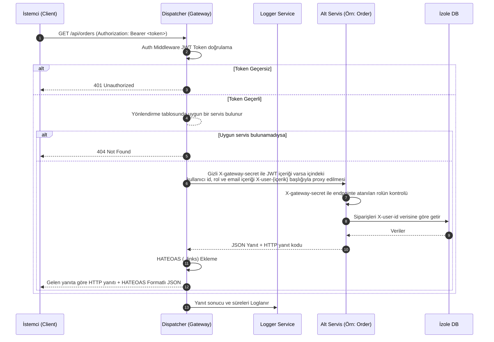

---

## TDD (Test-Driven Development) ve Yük Testleri

Dispatcher'ın TDD süreçleri (Red-Green-Refactor) NestJS'in test altyapısı (Jest) kullanılarak kodlanmıştır. Tüm Servislerin uygulanmadan önce test senaryoları yazılmasından sonra business logic yazılmıştır ve controller üzerine eklenmiştir.

### Performans Analizi (k6 Load Test)

Kullanıcı arayüzünde görülen istatistiklerin bilimsel zemini k6 ile test edilmiştir. Aşağıda belirtilen sekans diagramını belirten `load-test.js` yük testi 30s ramp-up → 1m sabit yük → 30s ramp-down profiliyle **50/100/200/500 eş zamanlı kullanıcı** sayısı olarak çalıştırılmıştır.

Yük testi `docker compose up` komutu kullanılarak sistem çalıştırılmıştır. Sistemin docker imajları toplam 2,69GB tutmuştur. Ram kullanımı pasif kullanımında 1,73GB, 500 eş zamanlı yük testinde 2,05GB'e kadar yükselmiştir.

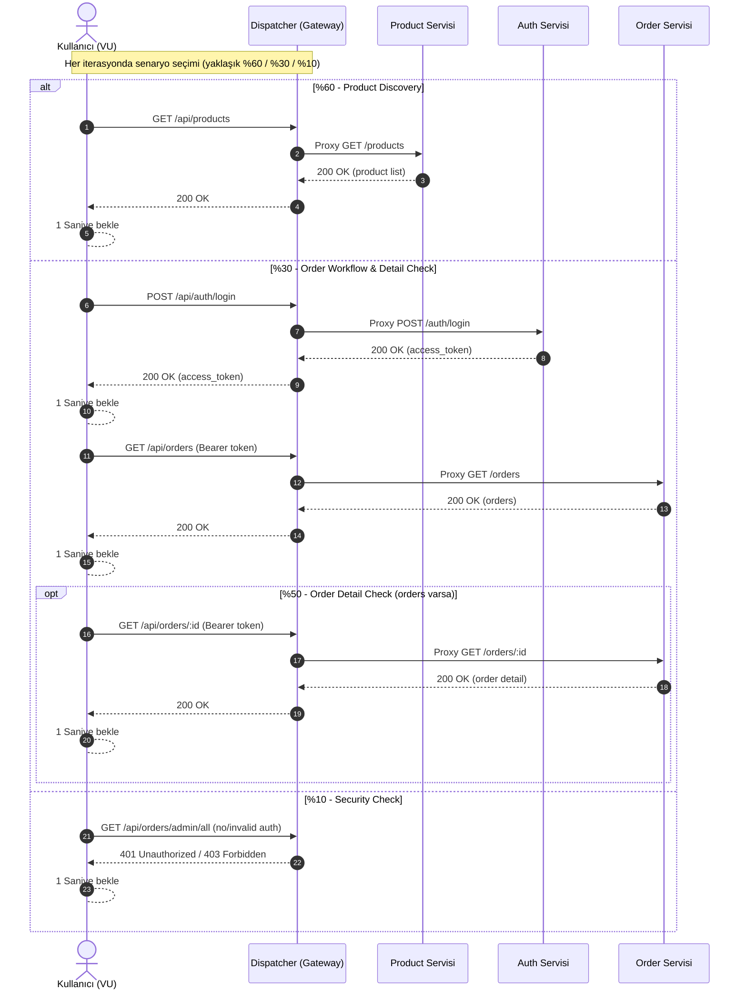

<details>
<summary>Tablo ve Grafikler</summary>

|                        Target (VU) | Request Count (`http_reqs`) | Throughput (RPS) | Avg Latency (ms) | Median (ms) | p95 (ms) | Max (ms) | Data Received (KiB/s) |
| ---------------------------------: | --------------------------: | ---------------: | ---------------: | ----------: | -------: | -------: | --------------------: |
|  [50](./load-tests/result-50.json) |                        4423 |            36.35 |            28.14 |        8.21 |    95.23 |   349.21 |                 41.08 |
| [100](./load-tests/result-100.json) |                       8705 |            72.28 |            43.00 |       11.73 |   149.70 |   571.39 |                 80.13 |
| [200](./load-tests/result-200.json) |                      13913 |           114.31 |           307.81 |       40.71 |  1617.71 |  4274.87 |                128.77 |
| [500](./load-tests/result-500.json) |                      18349 |           151.53 |          1516.00 |       23.85 |  8307.51 | 24304.59 |                169.70 |

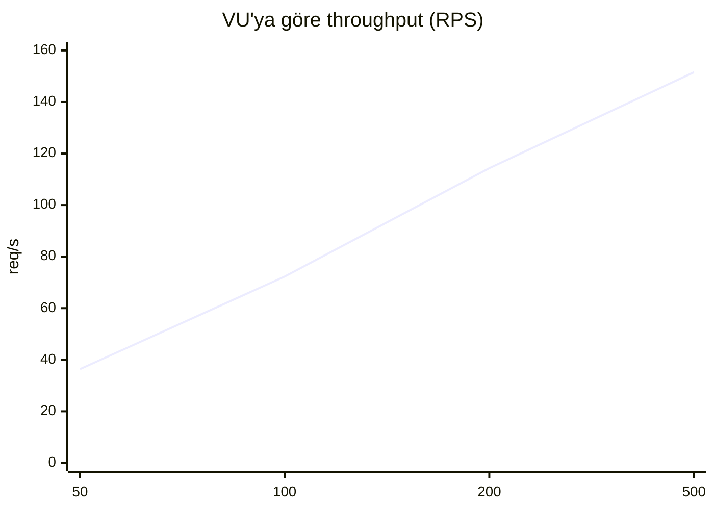

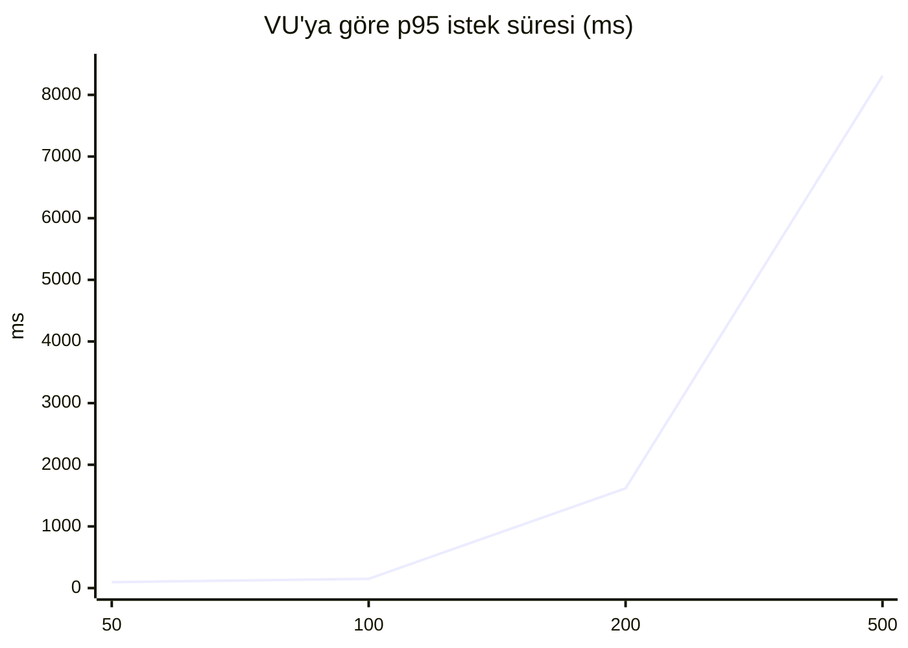

<details>
<summary>Test sırasında arayüz</summary>

### Ekran Görüntüleri (VU: 50 / 100 / 200 / 500)

Eş zamanlı 50 istek
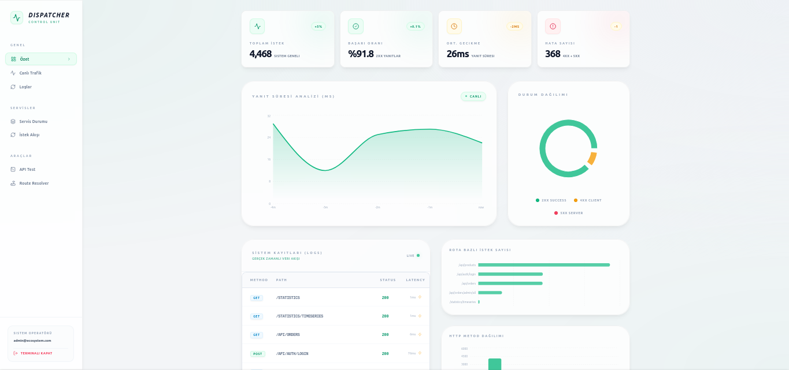

Eş zamanlı 100 istek
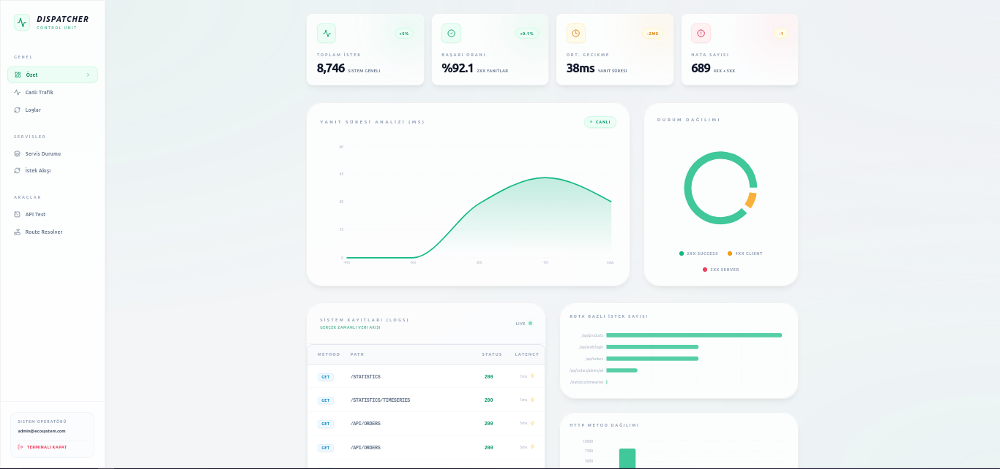

Eş zamanlı 200 istek
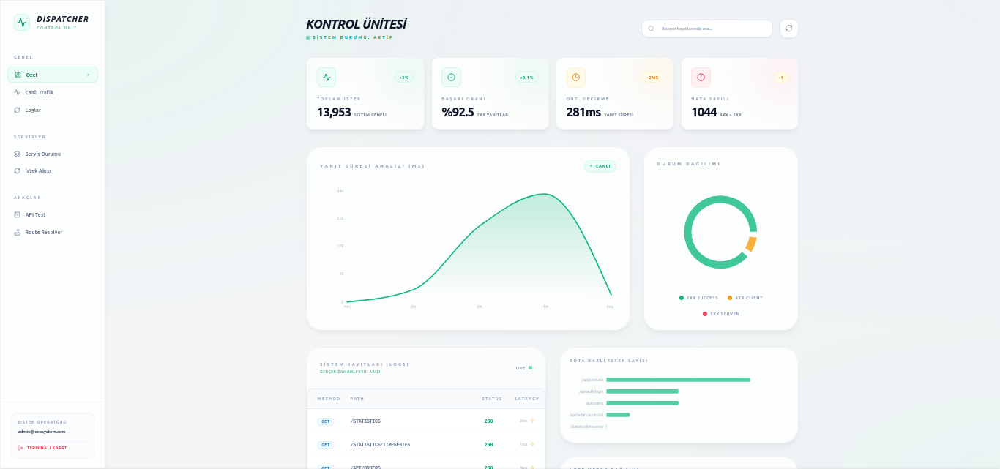

Eş zamanlı 500 istek
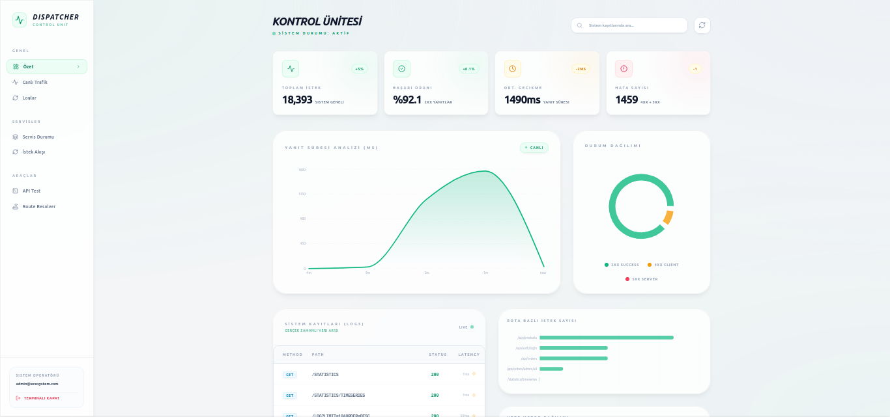

</details>

</details>

---

## Yönetim Paneli (Dashboard)

<details>
<summary>Dashboard</summary>

Dashboard Ana sayfa


Dashboard Gerçek Zamanlı İstek Arayüzü
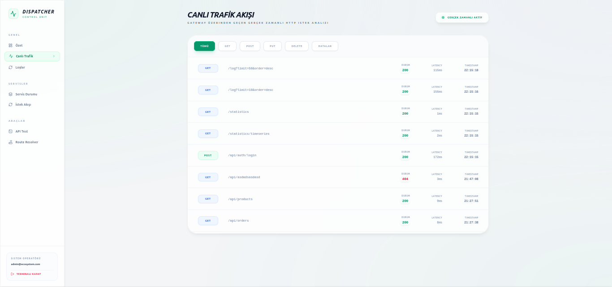

Dashboard Log Arayüzü
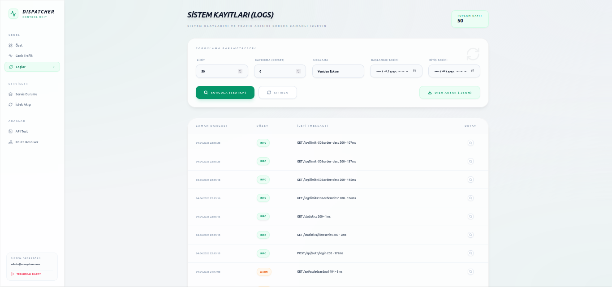

Dashboard Yönlendirme Arayüzü
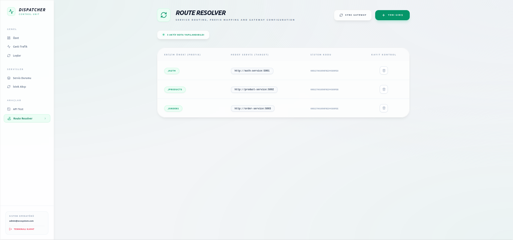

</details>

---

## Sonuç ve Tartışma

Mikroservis mimarisi başarıyla kurgulanmıştır. Network izolasyonu Docker Compose aracılığıyla sağlanmış; ek bir güvenlik katmanı olarak API Gateway kullanımı tercih edilmiştir. Gateway üzerinde JWT (JSON Web Token) çözümlenerek, kullanıcı bilgileri ilgili mikroservislere
HTTP Header'lar aracılığıyla güvenli bir şekilde iletilmektedir.

Ancak geliştirme sürecinde "Logout" (oturum kapatma) mekanizmasında bir problemle karşılaşılmıştır. Logout algoritması için başlangıçta Auth mikroservisi ile paylaşımlı bir veritabanı kullanımı planlanmıştır; fakat bu yaklaşım, mikroservislerin bağımsız veritabanlarına sahip olması (database-per-service) ilkesine aykırı olduğu için bu çözümden vazgeçilmiştir.

Yük testi sırasında, donanımda meydana gelen aşırı ısınmanın metriklerde tutarsızlığa ve değişkenliğe yol açtığı gözlemlenmiştir.
