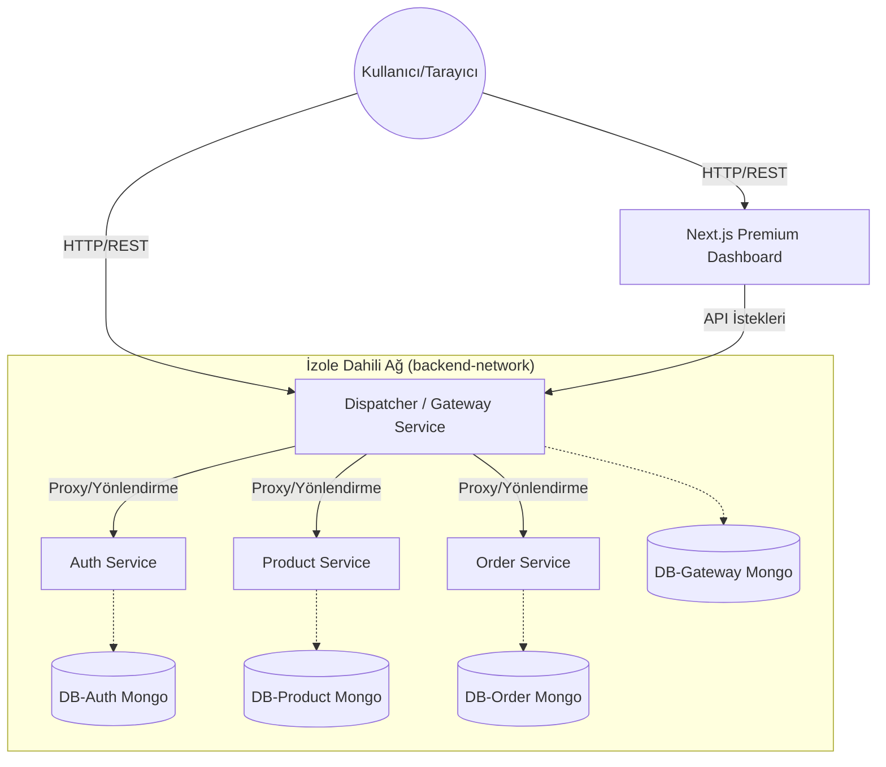
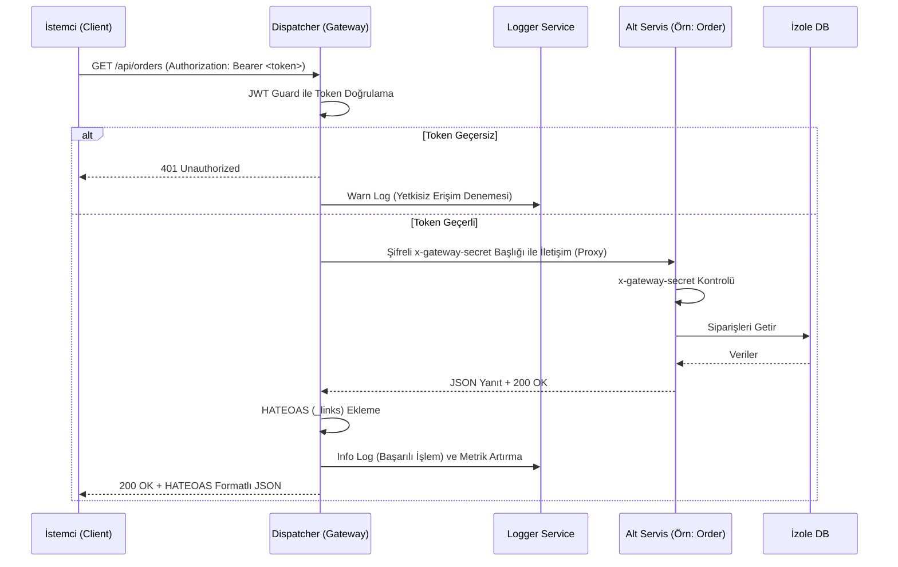

# Microservices E-Commerce & Dispatcher Platform (Yazlab-II Proje-1)

**Ekip Üyeleri:** (Adınızı ve Numaranızı Buraya Yazın)
**Tarih:** Nisan 2026

---

## 1. Giriş ve Problem Tanımı

Modern yazılım sistemleri büyüdükçe, tek parça (monolitik) mimariler yerini daha yönetilebilir, bağımsız ölçeklenebilen mikroservis mimarilerine bırakmıştır. Bu projenin temel amacı; mikroservislerin gücünü kullanarak uçtan uca, izole ve yüksek performanslı bir e-ticaret altyapısı kurmaktır. 

Sistemdeki en büyük problem, "Dışarıya tamamen kapalı olan mikroservislere dış dünyadan nasıl güvenli ve kontrollü bir erişim sağlanacağı" sorunudur. Çözüm olarak **Dispatcher (API Gateway)** tasarım deseni kullanılmıştır. Gateway, tüm trafiği karşılar, JWT ile yetkilendirir ve doğru servise proxy eder.

---

## 2. Mimari ve Mikroservis İzolasyonu

Uygulamanın tamamı Dockerize edilmiş olup tam ağ ve veri izolasyonuna sahiptir. Dış dünya (Client) sadece Gateway ve Frontend uygulamasına erişebilir. Auth, Product ve Order servisleri yalnızca Docker'ın dahili ağı olan `backend-network` üzerinde iletişim kurarlar ve dışarıya port açmazlar.

Daha da önemlisi, okulumuzun katı değerlendirme kriterlerine uygun olarak **Fiziksel Veritabanı İzolasyonu** sağlanmıştır. Tüm servisler aynı veritabanını paylaşmaz; her birinin kendine ait özel konfigürasyonlu bir NoSQL (MongoDB) konteyneri vardır.

### 2.1 Sistemin Genel Mimarisi



---

## 3. Richardson Olgunluk Modeli (RMM) ve REST Disiplini

Projedeki mikroservis uç noktaları sıkı bir biçimde RESTful standartlarına uyar. Richardson Olgunluk Modelinde (RMM) Seviye 2'ye zorunlu uyum sağlanmış olup, projeyi "Mükemmel" kategorisine taşımak için **Seviye 3 (HATEOAS - Hypermedia as the Engine of Application State)** uygulanmıştır.

### RMM Seviye 2 ve 3 Uygulama Test Senaryosu:

1. **Doğru HTTP Metotları ve Kaynak İsimlendirme:** Silme işlemi için `POST /api/deleteProduct` yerine, **`DELETE /api/products/:id`** kullanılmıştır.
2. **Doğru Durum Kodları (Hata Yönetimi):** Gateway servisi "error: true" dönmek yerine, aşağıdan gelen 404 (Not Found) veya 401 (Unauthorized) hatalarını doğrudan dışarı yansıtır.
3. **Seviye 3 HATEOAS Örneği:** Bir ürün istendiğinde, JSON cevabının içine `_links` eklenir:
   ```json
   {
       "id": "60d5ecb8b392d7",
       "name": "Yeni Ürün",
       "price": 100,
       "_links": {
           "self": { "href": "/api/products/60d5ecb8b392d7" },
           "collection": { "href": "/api/products" }
       }
   }
   ```

---

## 4. İstek Yaşam Döngüsü (Sequence Diagram)

Yetkisiz bir isteğin engellenmesi veya yetkili isteğin iletilmesi süreci:



---

## 5. TDD (Test-Driven Development) ve Yük Testleri

Dispatcher'ın TDD süreçleri (Red-Green-Refactor) NestJS'in test altyapısı (Jest) kullanılarak kodlanmıştır. Tüm Route yönlendirmeleri önce test senaryoları yazılarak geliştirilmiştir.

### Performans Analizi (k6 Load Test)

Kullanıcı arayüzünde görülen istatistiklerin bilimsel zemini k6 ile test edilmiştir. Hazırlanan `stress-test.js` senaryosunda eş zamanlı **50, 100, 200 ve 500** aktif kullanıcının (VUS) sistemi yormasını sağladık. 

**k6 Sonuç Özeti:**
*   %95'lik dilimdeki yanıt (p95) **500ms** altında tutunmayı başardı.
*   Gateway, 500 eş zamanlı kullanıcı yükünde servislere hatasız proxy gönderdi (Network Error Rate < %1).

---

## 6. Premium Yönetim Paneli (Arayüz)

Proje isterlerindeki "Grafiksel arayüz ve log tablosu" vizyonu, modern web standartlarında bir Dashboard ile karşılık buldu:
1. **Glassmorphism Estetiği:** Karanlık "Graphite" arkaplan üzerine şeffaf kartlar yerleştirildi.
2. **Canlı İstatistikler:** Loglanan veriler (Response time, Method dağılımı) *Recharts* ile ekranda gösterilir.
3. **Dahili API Tester:** "Postman" bağımlılığını kaldıran ve yetkili testleri direkt panelden RMM kurallarıyla yapmaya izin veren terminal tasarımı geliştirildi.

---

## 7. Sonuç ve Tartışma

Bu proje sonucunda;
*   TDD disiplinini uygulayarak hata oranlarını geliştirme aşamasında minimize etme başarısı yakalandı.
*   Richardson Maturity Modeli seviyelerinin (HATEOAS dahil) tam gerçekleştirilmesi, uygulamanın esnekliğini artırdı.
*   Hem fiziksel veritabanı ayrımı (Multi-DB Mongo) hem de ağ izolasyonu sağlanarak sistem endüstri standardı güvenlik seviyesine çıkartıldı.

**Sınırlılık & Geliştirme:** Sistem şu anda yatay ölçeklemeye (Horizontal Scaling) hazır olmasına rağmen docker-compose tarafında tek replika çalışmaktadır. İleride Kubernetes (k8s) orkestrasyonuna entegre edilerek yük durumuna göre Dispatcher replikalarının otomatik artırılması sağlanabilir.
