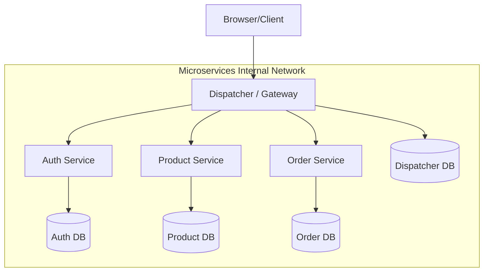

# Microservices E-Commerce Project (Yazlab-II Proje-1)

This project is a mini e-commerce system built with a microservices architecture for the Kocaeli University Software Development Laboratory-II Course.

## Architecture Highlights

- **Independent Services**: Dispatcher, Auth, Product, and Order.
- **TDD-First**: Dispatcher developed using Red-Green-Refactor.
- **Security**: Centralized JWT and RBAC at the Dispatcher level.
- **Isolation**: Microservices are not reachable from the outside; only via Dispatcher.
- **Database**: Each service has its own isolated MongoDB instance.
- **Scalability**: Traffic visualization and Load testing (k6) included.

## Technology Stack

- **Frontend**: Next.js + React
- **Backend**: NestJS (Microservices)
- **Database**: MongoDB
- **Containerization**: Docker & Docker Compose
- **Test**: Jest (Unit/Integration), k6 (Load)

## Getting Started

### Prerequisites

- Docker & Docker Compose
- Node.js (for local development)

### One-Command Setup

```bash
docker-compose up --build
```

## Mermaid Diagrams

### System Architecture



## API Specification (Richardson Maturity Model Level 2)

### Dispatcher Endpoints (/api)

- `POST /api/auth/register`
- `POST /api/auth/login`
- `GET /api/products`
- `GET /api/products/:id`
- `POST /api/products` (Admin)
- `PUT /api/products/:id` (Admin)
- `DELETE /api/products/:id` (Admin)
- `POST /api/orders` (User)
- `GET /api/orders` (User)
- `GET /api/admin/orders` (Admin)
- `GET /api/admin/logs` (Admin)
